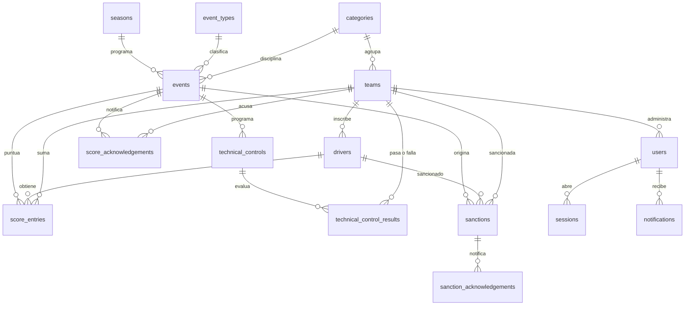

# US2 — Diseño del modelo de datos

## Objetivo

Identificar las entidades del dominio, sus relaciones y sus atributos, elegir el tipo de base de
datos que corresponde al problema, e implementar el modelo de forma que una categoría o escudería
nueva no exija cambios estructurales.

## 1. Decisión sobre el tipo de base de datos

**Elegimos relacional (PostgreSQL).** La justificación está en `01-stack.md`; el resumen es que el
dominio es relacional por definición y no por conveniencia:

- Un piloto pertenece a una escudería, dentro de una categoría.
- Un puntaje identifica piloto, escudería, carrera y posición, y es una tabla de unión con atributos.
- Una sanción aplica a un piloto **o** a una escudería, y debe conservar su historial aunque el
  evento se modifique.

MongoDB obligaría a simular claves foráneas, `UNIQUE` y agregaciones de campeonato con documentos
embebidos, y no aportaría integridad referencial declarativa.

## 2. Criterios de normalización

El modelo está en **tercera forma normal (3FN)**. Decisiones concretas y su motivo:

| Decisión | Motivo |
|----------|--------|
| Los datos de referencia (categorías, temporadas, tipos de evento) viven en tablas, no en `ENUM` ni en `CHECK` sueltos | Un valor nuevo es un `INSERT`, no una reescritura de tabla |
| Roles y estados con `CHECK`, no con el tipo `ENUM` de PostgreSQL | Agregar un rol es una migración aditiva. `ENUM` exige `ALTER TYPE` con lock sobre la tabla |
| Ninguna tabla de negocio repite un dato que pueda derivarse | Se evita la anomalía de actualización |
| `teams.category_id` en vez de una tabla puente de temporadas | Cada FK del dominio (sanciones, puntajes, controles) queda con un solo valor. Si aparece el requisito de participación por temporada, `team_seasons` se agrega como tabla **nueva** |

### Denormalización deliberada: `score_entries.team_id`

`score_entries` va a guardar el `team_id` aunque hoy se pueda derivar del piloto. **No es una
anomalía**: los pilotos cambian de escudería a mitad de temporada, y un puntaje tiene que registrar
para quién se contabilizó. Derivar el equipo actual mostraría un histórico incorrecto.

### Trampa evitada: `sanctions.subject_type` / `subject_id`

Una sanción aplica a un piloto **o** a una escudería. La tentación es modelarlo con
`(subject_type, subject_id)`, que es el patrón *polimórfico*: no tiene clave foránea, no hay
integridad referencial y las consultas requieren `WHERE` con `OR` sobre columnas sin tipar.

En su lugar usamos **dos FK opcionales con un `CHECK` de exclusividad**:

```sql
CONSTRAINT sanctions_single_subject CHECK (num_nonnulls(driver_id, team_id) = 1)
```

`num_nonnulls` cuenta cuántos argumentos no son nulos, así que la restricción se lee igual que la
regla: exactamente un sancionado. Se prefirió a la comparación de booleanos
`(driver_id IS NULL) <> (team_id IS NULL)`, que es equivalente pero fácil de escribir mal: una
versión anterior de este documento usaba `team_id IS NOT NULL` en el lado derecho, lo que invertía
la regla y rechazaba justamente los dos casos válidos.

| `driver_id` | `team_id` | Resultado |
|-------------|-----------|-----------|
| con valor | nulo | aceptada |
| nulo | con valor | aceptada |
| con valor | con valor | rechazada |
| nulo | nulo | rechazada |

Una sola tabla, integridad referencial completa, y cada consulta es directa.

## 3. Diagrama entidad-relación (modelo completo)

Las tablas marcadas como *(S2)* se implementan en el Sprint 2; las demás ya están migradas.



## 4. Entidades del Sprint 1 (implementadas)

### `categories` — las cuatro categorías del enunciado
`id`, `code` (UNIQUE, natural key), `name`, `created_at`, `updated_at`

### `seasons` — temporadas de competencia
`id`, `year` (UNIQUE), `created_at`, `updated_at`

### `teams` — escuderías
`id`, `category_id` → `categories`, `code`, `name`, `created_at`, `updated_at`
UNIQUE (`category_id`, `code`)

### `users` — administradores FIA y de escudería
`id`, `username` (UNIQUE), `email` (UNIQUE, nullable), `password_hash`, `role`, `team_id`
(nullable), `is_active`, `deactivated_at`, `created_at`, `updated_at`

`is_active` es una columna generada (`deactivated_at IS NULL`): la baja se registra solo con la
fecha, y el estado se deriva de ella. Así los dos campos no pueden contradecirse y el modelo
respeta la regla de no guardar datos derivables.

### `sessions` — sesiones opacas del lado del servidor
`id`, `user_id` → `users`, `token_hash` (UNIQUE), `created_at`, `last_used_at`,
`absolute_expires_at`, `revoked_at`, `ip`, `user_agent`

### `login_attempts` — auditoría y bloqueo por intentos
`id`, `username`, `succeeded`, `ip`, `attempted_at`

## 5. Entidades del Sprint 2 (diseñadas)

- **`drivers`** *(S2)* — `id`, `team_id`, `first_name`, `last_name`, `license_number` (UNIQUE),
  `is_starter` (titular o suplente), `deactivated_at` e `is_active` generada, como en `users`.
  El enunciado distingue piloto titular de suplente, así que es un atributo, no otra entidad. La
  categoría no se guarda: se deriva de la escudería (`teams.category_id`), y guardarla dos veces
  permitiría un piloto de F2 en una escudería de F1.
- **`event_types`** *(S2)* — catálogo: `race`, `tyre_test`, `technical_control`. Permite sumar tipos
  sin cambiar el esquema.
- **`events`** *(S2)* — calendario. `id`, `event_type_id`, `season_id`, `category_id`,
  `name`, `starts_at`, `ends_at`, `location`, `circuit`, `round`. Un solo tipo de tabla para
  carreras y pruebas de neumáticos: difieren en atributos, no en estructura.
- **`score_entries`** *(S2)* — `id`, `event_id`, `driver_id`, `team_id` (desnormalizado a
  propósito), `position`, `points`. UNIQUE (`event_id`, `driver_id`).
- **`score_acknowledgements`** *(S2)* — `id`, `event_id`, `team_id`, `acknowledged_by` → `users`,
  `acknowledged_at`. UNIQUE (`event_id`, `team_id`): una escudería acusa una vez por carrera.
- **`technical_controls`** *(S2)* — `id`, `event_id`, `name`, `control_type`.
- **`technical_control_results`** *(S2)* — `id`, `technical_control_id`, `team_id`, `passed`,
  `notes`.
- **`sanctions`** *(S2)* — `id`, `event_id`, `driver_id` (nullable), `team_id` (nullable),
  `reason`, `description`, `points_penalty`, `issued_at`. CHECK de exactamente un sancionado.
- **`sanction_acknowledgements`** *(S2)* — `id`, `sanction_id`, `team_id`, `acknowledged_by`,
  `acknowledged_at`.
- **`notifications`** *(S2)* — `id`, `user_id`, `kind`, `title`, `body`, `read_at`.

## 6. Claves primarias y por qué `GENERATED ALWAYS`

Todas las PK son `bigint GENERATED ALWAYS AS IDENTITY`. El detalle importa:

- `ALWAYS` hace que la base de datos **rechace** cualquier `INSERT` que asigne un id a mano
  (salvo `OVERRIDING SYSTEM VALUE`, que usamos solo en el seed). Con `BY DEFAULT` eso sería un
  accidente fácil, y el síntoma sería un desync de la secuencia que se manifiesta mucho después
  como un bug de clave foránea inexplicable.
- Como nunca se borran filas (baja lógica con `is_active`), **los ids no se reciclan**: un id que
  existió hoy significa la misma fila para siempre.

## 7. Conflictos entre ramas

El problema real no son las claves sino las **filas**. La regla del equipo:

> Las migraciones se fusionan. Los datos se regeneran.

- Los archivos `.sql` numerados de `backend/migrations/` son lo único que se versiona y se mergea,
  y contienen **solo DDL**. Ninguna migración inserta filas.
- Los datos de referencia viven en `backend/seeds/reference.sql`, son **idempotentes**
  (`ON CONFLICT DO NOTHING`) y **no se registran en `schema_migrations`**. Por eso `make seed`
  se puede correr las veces que haga falta.
- El seed usa **ids fijos** y termina con `setval` tomando el `max(id)` vivo, así que todos los
  entornos comparten los mismos ids para las mismas filas (`categories` 1–4, `teams` 1–8,
  `seasons` 1) y una fila insertada desde la app nunca hace retroceder la secuencia.
- Ante un conflicto de seed no se fusiona el archivo: se corre `make db-reset`. Ninguna fila hay
  que preservarla, porque el seed es regenerable.

Verificado: `make db-reset` reproduce exactamente los mismos ids, y `make seed` corrido dos veces
seguidas no duplica ninguna fila.

### Por qué los datos no viven en las migraciones

La primera versión de este modelo metía el seed como migración `000002`. Eso tenía tres
consecuencias que se descartaron:

| Problema | Consecuencia |
|----------|--------------|
| La cadena de migraciones se ejecuta en producción | Las cuentas de demo con contraseña conocida se habrían desplegado |
| Un seed aplicado no se puede editar | Cada corrección del dato de demo agregaba una migración, y la cadena terminaba siendo mayoritariamente datos |
| `migrate-down 1` borraba filas | Revertir el esquema eliminaba datos de forma silenciosa |

Ahora la separación es explícita: **`make migrate` solo crea el esquema y `make seed` carga los
datos.** Como producción corre `make seed` como paso de deploy, hay que recordar ese paso: sin él
la aplicación arranca sin categorías y todas las pantallas salen vacías.

Efecto secundario que conviene tener presente: `make migrate-down` ahora tira el esquema entero
(tablas y filas). Es un borrado explícito y total, no el estado intermedio confuso del diseño
anterior, donde quedaba un esquema válido pero sin datos de referencia.

## 8. Verificaciones ejecutadas

```
$ make db-reset           # drop + migrate + seed: categorías 1..4 y equipos 1..8
$ make migrate            # segunda vez: idempotente, no inserta filas
$ make seed               # segunda vez: idempotente, no duplica filas
$ make migrate-down       # tira el esquema entero; se recupera con migrate + seed
$ make seed               # tras un rollback, los ids vuelven a ser 1..4 y 1..8
```

Comprobado además que `make seed` no retrocede la secuencia cuando hay filas insertadas desde la
aplicación: se insertó un equipo (id 9), se reejecutó el seed y el siguiente insert recibió el
id 10.

Restricciones comprobadas contra la base real (todas rechazan el dato inválido):

| Caso | Resultado |
|------|-----------|
| `team_admin` sin `team_id` | rechazado por `users_team_admin_has_team` |
| `fia_admin` **con** `team_id` | rechazado por `users_team_admin_has_team` |
| `role = 'public'` | rechazado por `users_role_valid` |
| `username = 'Admin'` (mayúsculas) | rechazado por `users_username_format` |
| `username = 'ad min!'` | rechazado por `users_username_format` |
| `INSERT` con `id` explícito | rechazado: *cannot insert a non-DEFAULT value* |

El caso "usuario inactivo sin fecha de baja" ya no necesita una restricción propia: como
`is_active` se deriva de `deactivated_at`, no se puede representar.

## Criterios de éxito

| Criterio | Estado |
|----------|--------|
| Tipo de base de datos justificado según el dominio | ✅ sección 1 |
| Entidades definidas y relacionadas | ✅ secciones 3 y 4 |
| El modelo escala a nuevas categorías o escuderías sin cambios estructurales | ✅ `categories` y `teams` son tablas de datos; agregar una categoría es un `INSERT` |

## Deuda técnica registrada

| Deuda | Por qué | Cómo se resuelve |
|-------|---------|------------------|
| Los ids de las tablas no son contiguos | Las secuencias de identidad no participan del rollback transaccional: un `INSERT` que falla consume el valor | Es el comportamiento estándar de PostgreSQL y **nadie debe asumir que los ids son correlativos** |
| `teams.category_id` asume una categoría por escudería | El enunciado no pide participación por temporada | `team_seasons` se agrega como tabla nueva, sin tocar `teams` |
| No hay `deleted_at` en `sessions` | Una sesión revocada no se borra: `revoked_at` alcanza | — |
| `make migrate` no inserta datos | Consecuencia de separar esquema y datos | `make seed` es paso obligatorio del deploy |
