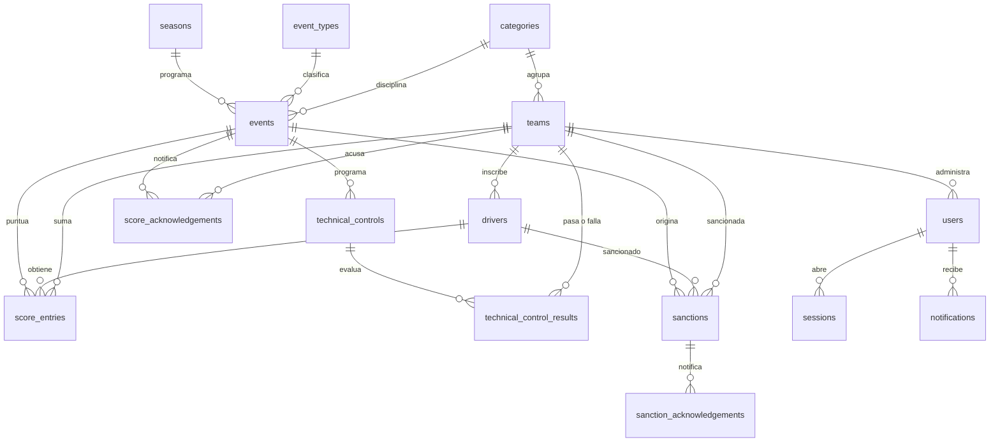

# US2 — Diseño del modelo de datos

## Objetivo

Identificar las entidades del dominio, sus relaciones y sus atributos, elegir el tipo de base de
datos que corresponde al problema, e implementar el modelo de forma que una categoría o escudería
nueva no exija cambios estructurales.

## 1. Decisión sobre el tipo de base de datos

**Elegimos relacional (PostgreSQL).** La justificación está en `01-stack.md`.

## 2. Criterios de normalización

El modelo está en **tercera forma normal (3FN)**. Decisiones concretas y su motivo:

| Decisión | Motivo |
|----------|--------|
| Los datos de referencia (categorías, temporadas, tipos de evento) viven en tablas, no en `ENUM` ni en `CHECK` sueltos | Un valor nuevo es un `INSERT`, no una reescritura de tabla |
| Roles y estados con `CHECK`, no con el tipo `ENUM` de PostgreSQL | Agregar un rol es una migración aditiva. `ENUM` exige `ALTER TYPE` con lock sobre la tabla |
| Ninguna tabla de negocio repite un dato que pueda derivarse | Se evita la anomalía de actualización |
| `teams.category_id` en vez de una tabla puente de temporadas | Cada FK del dominio (sanciones, puntajes, controles) queda con un solo valor. Si aparece el requisito de participación por temporada, `team_seasons` se agrega como tabla **nueva** |

### Denormalización deliberada: `score_entries.team_id`

`score_entries` va a guardar el `team_id` aunque hoy se pueda derivar del piloto. **No es una
anomalía**: los pilotos cambian de escudería a mitad de temporada, y un puntaje tiene que registrar
para quién se contabilizó. Derivar el equipo actual mostraría un histórico incorrecto.

### Trampa evitada: `sanctions.subject_type` / `subject_id`

Una sanción aplica a un piloto **o** a una escudería. La tentación es modelarlo con
`(subject_type, subject_id)`, que es el patrón *polimórfico*: no tiene clave foránea, no hay
integridad referencial y las consultas requieren `WHERE` con `OR` sobre columnas sin tipar.

En su lugar usamos **dos FK opcionales con un `CHECK` de exclusividad**:

```sql
CONSTRAINT sanctions_single_subject CHECK (num_nonnulls(driver_id, team_id) = 1)
```

`num_nonnulls` cuenta cuántos argumentos no son nulos, así que la restricción se lee igual que la
regla: exactamente un sancionado. Se prefirió a la comparación de booleanos
`(driver_id IS NULL) <> (team_id IS NULL)`, que es equivalente pero fácil de escribir mal: una
versión anterior de este documento usaba `team_id IS NOT NULL` en el lado derecho, lo que invertía
la regla y rechazaba justamente los dos casos válidos.

## 3. Diagrama entidad-relación (modelo completo)



## 4. Entidades implementadas

### `categories` — las cuatro categorías del enunciado
`id`, `code` (UNIQUE, natural key), `name`, `created_at`, `updated_at`

### `seasons` — temporadas de competencia
`id`, `year` (UNIQUE), `created_at`, `updated_at`

### `teams` — escuderías
`id`, `category_id` → `categories`, `code`, `name`, `created_at`, `updated_at`
UNIQUE (`category_id`, `code`)

### `users` — administradores FIA y de escudería
`id`, `username` (UNIQUE), `email` (UNIQUE, nullable), `password_hash`, `role`, `team_id`
(nullable), `is_active`, `deactivated_at`, `created_at`, `updated_at`

`is_active` es una columna generada (`deactivated_at IS NULL`): la baja se registra solo con la
fecha, y el estado se deriva de ella. Así los dos campos no pueden contradecirse y el modelo
respeta la regla de no guardar datos derivables.

### `sessions` — sesiones opacas del lado del servidor
`id`, `user_id` → `users`, `token_hash` (UNIQUE), `created_at`, `last_used_at`,
`absolute_expires_at`, `revoked_at`, `ip`, `user_agent`

### `login_attempts` — auditoría y bloqueo por intentos
`id`, `username`, `succeeded`, `ip`, `attempted_at`

## 5. Proximas posibles entidades

- **`drivers`** — `id`, `team_id`, `first_name`, `last_name`, `license_number` (UNIQUE),
  `is_starter` (titular o suplente), `deactivated_at` e `is_active` generada, como en `users`.
  El enunciado distingue piloto titular de suplente, así que es un atributo, no otra entidad. La
  categoría no se guarda: se deriva de la escudería (`teams.category_id`), y guardarla dos veces
  permitiría un piloto de F2 en una escudería de F1.
- **`event_types`** — catálogo: `race`, `tyre_test`, `technical_control`. Permite sumar tipos
  sin cambiar el esquema.
- **`events`** — calendario. `id`, `event_type_id`, `season_id`, `category_id`,
  `name`, `starts_at`, `ends_at`, `location`, `circuit`, `round`. Un solo tipo de tabla para
  carreras y pruebas de neumáticos: difieren en atributos, no en estructura.
- **`score_entries`** — `id`, `event_id`, `driver_id`, `team_id` (desnormalizado a
  propósito), `position`, `points`. UNIQUE (`event_id`, `driver_id`).
- **`score_acknowledgements`** — `id`, `event_id`, `team_id`, `acknowledged_by` → `users`,
  `acknowledged_at`. UNIQUE (`event_id`, `team_id`): una escudería acusa una vez por carrera.
- **`technical_controls`** — `id`, `event_id`, `name`, `control_type`.
- **`technical_control_results`** — `id`, `technical_control_id`, `team_id`, `passed`,
  `notes`.
- **`sanctions`** — `id`, `event_id`, `driver_id` (nullable), `team_id` (nullable),
  `reason`, `description`, `points_penalty`, `issued_at`. CHECK de exactamente un sancionado.
- **`sanction_acknowledgements`** — `id`, `sanction_id`, `team_id`, `acknowledged_by`,
  `acknowledged_at`.
- **`notifications`** — `id`, `user_id`, `kind`, `title`, `body`, `read_at`.

## 6. Conflictos entre ramas

El problema real no son las claves sino las **filas**. La regla del equipo:

> Las migraciones se fusionan. Los datos se regeneran.

- Los archivos `.sql` numerados de `backend/migrations/` son lo único que se versiona y se mergea,
  y contienen **solo DDL**. Ninguna migración inserta filas.
- Los datos de referencia viven en `backend/seeds/reference.sql`, son **idempotentes**
  (`ON CONFLICT DO NOTHING`) y **no se registran en `schema_migrations`**. Por eso `make seed`
  se puede correr las veces que haga falta.
- Ante un conflicto de seed no se fusiona el archivo: se corre `make db-reset`. Ninguna fila hay
  que preservarla, porque el seed es regenerable.

### Por qué los datos no viven en las migraciones

La primera versión de este modelo metía el seed como migración `000002`. Eso tenía tres
consecuencias que se descartaron:

| Problema | Consecuencia |
|----------|--------------|
| La cadena de migraciones se ejecuta en producción | Las cuentas de demo con contraseña conocida se habrían desplegado |
| Un seed aplicado no se puede editar | Cada corrección del dato de demo agregaba una migración, y la cadena terminaba siendo mayoritariamente datos |
| `migrate-down 1` borraba filas | Revertir el esquema eliminaba datos de forma silenciosa |
