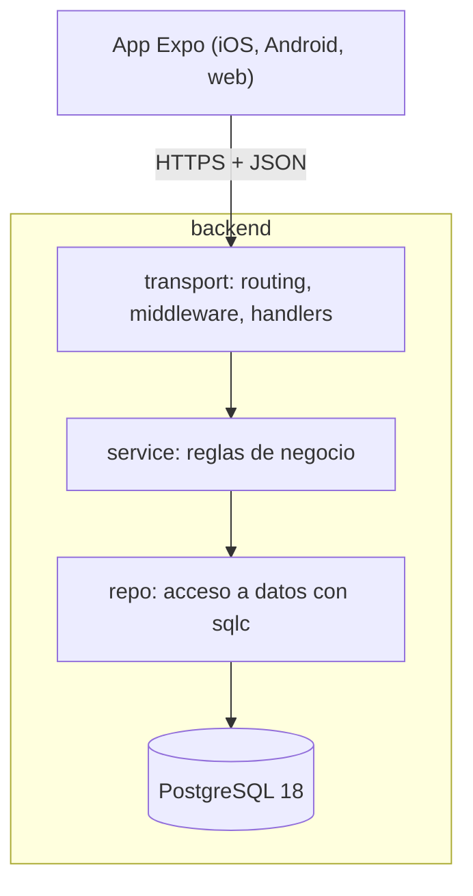

# US3 — Arquitectura, roles y seguridad

## Objetivo

Diseñar tres cosas que el enunciado exige que estén resueltas **desde el diseño** y no después:

1. La arquitectura general del sistema: capas, módulos y comunicación.
2. El modelo de permisos por rol, que define qué puede hacer cada tipo de usuario sobre cada
   componente.
3. Los estándares de seguridad: autenticación, cifrado y políticas.

Las tres se decidieron juntas a propósito: el modelo de permisos determina la forma de las sesiones,
y las sesiones determinan cómo viaja la identidad por la app. Diseñarlas por partes produce
autenticación que no puede soportar el permiso que hace falta.

## 1. Decisión de arquitectura: monolito modular

**Elegimos un monolito modular en un solo binario Go**, no microservicios.

El motivo es que el dominio es una base de datos relacional con transacciones que cruzan módulos.
Un puntaje de carrera y su acuse de recibo por parte de la escudería tienen que ser consistentes
juntos; los controles técnicos y las sanciones sobre un mismo evento también. Con microservicios
eso son transacciones distribuidas, con el mismo modelo de datos replicado en varios servicios y
un problema de consistencia que todavía no tenemos requisitos para resolver.

La modularidad no se descarta: cada módulo del dominio vive en su propio paquete de
`internal/`, con dependencias que apuntan en una sola dirección. Si en un futuro un módulo
demuestra que necesita escalar o desplegarse aparte, se extrae sin reescribirlo, porque sus
fronteras ya están marcadas.

### 1.1 Capas

Tres capas, con la dependencia apuntando siempre hacia adentro:

| Capa | Paquete | Responsabilidad | Lo que **no** hace |
|------|---------|-----------------|---------------------|
| `transport` | `internal/transport` | Decodificar JSON, validar formato, extraer identidad, escribir la respuesta | Reglas de negocio, SQL |
| `service` | `internal/<dominio>` | Reglas del dominio, autorización, orquestación | Conocer `http`, escribir SQL |
| `repo` | `internal/<dominio>` y `backend/sql/` | Ejecutar consultas tipadas | Decidir qué es válido |

La regla que hace que esto se sostenga: **el handler nunca contiene una regla de negocio.** Si un
handler necesita decidir algo del dominio, esa decisión va al service; si necesita un dato, va al
repo. Un handler que consulta la base directamente es un error de diseño aunque funcione.

Los errores se traducen a HTTP en **una sola capa**. El service devuelve errores de dominio
(`ErrNotFound`, `ErrForbidden`, `ErrConflict`) y un punto único los mapea a códigos HTTP. Así el
mismo error se ve igual desde cualquier endpoint.

### 1.2 Módulos

Un paquete por módulo del enunciado. Cada uno aporta sus tres capas cuando le toque:

| Módulo | Responsabilidad | Implementado |
|--------|-----------------|--------|
| `auth` | Hashing de contraseñas (Argon2id), middleware de identidad y RBAC | US5 |
| `sessions` | Creación, expiración y revocación de sesiones | US5 |
| `users` | Alta, modificación, baja lógica, búsqueda y listado de cuentas | US6 |
| `calendar` | Eventos: carreras, pruebas de neumáticos, controles técnicos | futuro |
| `scores` | Puntajes por carrera y acuses de recibo de las escuderías | futuro |
| `drivers` | Pilotos titulares y suplentes por escudería | futuro |
| `controls` | Controles técnicos y su resultado por escudería | futuro |
| `sanctions` | Sanciones a pilotos o escuderías y sus acuses | futuro |
| `notifications` | Mensajería interna y avisos entre FIA y escuderías | futuro |

### 1.3 Comunicación

- **REST sobre HTTP/1.1 con JSON**, un recurso por endpoint.
- **Una sola API para los tres roles.** La app no replica reglas de negocio para decidir qué
  mostrar: pide los datos y el backend devuelve lo que ese rol puede ver.
- **Móvil y web usan el mismo cliente** (`app/src/api`), lo que evita que la lógica de sesión
  diverja entre plataformas.
- **La identidad viaja en la sesión**, no en un header `Authorization` con un JWT. La razón está en
  la sección 4: necesitamos revocación inmediata.
- El enunciado pide también que toda la funcionalidad esté disponible desde la app móvil. Como la
  app es una sola base de código con `expo-router`, la misma ruta sirve para iOS, Android y web.

## 2. Modelo de permisos por rol

### 2.1 Los tres roles

| Rol | Tiene cuenta | Quién lo crea |
|-----|--------------|---------------|
| `fia_admin` | Sí | El primero, con `make create-admin`; los demás, con la US6 |
| `team_admin` | Sí | La US6, asignado a una escudería concreta |
| Público | **No** | Nadie: es la ausencia de sesión |

El público **no es un valor de `users.role`**. Es una decisión de diseño, no una comodidad: si fuera
un rol almacenado, habría que aceptar usuarios sin contraseña, y el `CHECK` del rol se volvería una
excepción permanentemente abierta. Como el público no tiene sesión, el backend responde a un endpoint
público sin mirar la tabla `users`, y el `CHECK users_role_valid` sigue siendo estricto.

### 2.2 Matriz de permisos

`C` crear · `R` leer · `U` modificar · `D` eliminar · `N` notificar recepción · `Desc` descargar

| Recurso | `fia_admin` | `team_admin` | Público |
|---------|-------------|--------------|---------|
| Escuderías (catálogo) | R | R | R |
| Calendario (eventos) | C R U D | R Desc | R Desc |
| Reglamentos | C R U D | R Desc | R Desc |
| Puntajes | C R U | R N | R |
| Pilotos | R | C R U (solo su escudería) | R |
| Controles técnicos | C R U + resultados | R | R |
| Sanciones | C R U | R N | R |
| Pruebas de neumáticos | C R U | R | R |
| Notificaciones | C (emitir) R | R (recibir) | — |
| Cuentas de usuario | C R U D (baja lógica) + búsqueda | — | — |
| Perfil propio | R U | R U | — |

## 3. Estándares de seguridad

### 3.1 Contraseñas

**Argon2id** (RFC 9106), que es la función recomendada hoy para contraseñas y es resistente tanto a
ataques con GPU como a crackers de memoria.

| Parámetro | Valor por defecto | Variable |
|-----------|-------------------|----------|
| Memoria | 64 MiB | `ARGON2_MEMORY_KIB` |
| Iteraciones | 3 | `ARGON2_ITERATIONS` |
| Paralelismo | 2 | `ARGON2_PARALLELISM` |
| Longitud del salt | 16 bytes | fijo |
| Longitud del hash | 32 bytes | fijo |

Los parámetros quedan **codificados dentro del hash** que se guarda, en el formato
`$argon2id$v=19$m=...,t=...,p=...$salt$hash`. Eso permite subir la memoria o las iteraciones en el
futuro sin invalidar las contraseñas existentes: al verificar se lee el coste del hash almacenado, y
si está por debajo del configurado se rehashea con el nuevo coste en el próximo login correcto.

Los parámetros son configurables porque dependen del hardware: los 64 MiB por defecto apuntan a un
servidor modesto. En una máquina de escritorio el límite pasa a ser la latencia aceptable, no la
memoria disponible. Los valores por defecto son un piso, y subirlos es una decisión que se toma con
el hardware real en la mano, no un número fijo para siempre.

**Política de contraseñas.** No se exigen reglas de símbolos: longitud mínima de 12 caracteres y se
rechaza la contraseña cuando es igual o muy parecida al `username` o al `email` del usuario. Las
frases largas son mejores que las reglas de símbolos, que empujan a la gente a usar patrones
predecibles. El límite de longitud solo está para acotar la entrada: hasta 128 caracteres.

### 3.2 Sesiones

Sesiones **opacas del lado del servidor**. El cliente nunca ve datos ni una firma: ve un token
aleatorio que no significa nada fuera de la base.

| Aspecto | Decisión | Motivo |
|---------|----------|--------|
| Generación | 32 bytes de `crypto/rand`, codificados en base64url | 256 bits de entropía; impredecible por fuerza bruta |
| Almacenamiento | Solo el **SHA-256** del token | Una filtración de la base no permite iniciar sesión |
| Transporte (web) | Cookie `httpOnly; Secure; SameSite=Strict; Path=/` | El JavaScript de la página no puede leerla |
| Transporte (móvil) | `expo-secure-store` | Equivalente nativo, en el llavero del sistema |
| Expiración por inactividad | 12 h (`SESSION_IDLE_TTL`) | Cierra sesiones olvidadas en un teléfono compartido |
| Expiración absoluta | 7 días (`SESSION_ABSOLUTE_TTL`) | Una sesión robada tiene un techo de vida, aunque el atacante la mantenga activa |
| Revocación | Inmediata, por `revoked_at` | Requisito del enunciado: desactivar una cuenta la expulsa ya |

**Por qué no JWT.** Un JWT se valida sin consultar la base, que es su ventaja, y ese mismo motivo es
el problema: la revocación es diferida hasta que expira. El enunciado pide que desactivar un usuario
lo saque del sistema de inmediato, y un JWT no lo cumple sin una lista de revocación que termina
siendo la tabla de sesiones que se quiso evitar. La sesión opaca paga una consulta por request
autenticado, que es el costo correcto para este dominio.

**Sin rotación por request.** La rotación en cada uso es una recomendación habitual cuando el
token vive en una cookie, pero se descartó por una razón concreta: dos peticiones simultáneas con
la misma sesión (un formulario que dispara dos requests, dos pestañas abiertas) se invalidan
mutuamente y cierran la sesión del usuario sin que haya hecho nada. En su lugar:

- **Cada login emite una sesión nueva**, así que un token nunca sobrevive a un nuevo inicio de
  sesión, y un token fijado de antemano por un atacante no sirve.
- **Un cambio de rol, de escudería o de estado revoca todas las sesiones del usuario** (US6). El
  usuario vuelve a entrar y su nueva sesión ya refleja los privilegios actuales.
- La expiración por inactividad se actualiza con `last_used_at` de forma **amortiguada** (como
  máximo una escritura cada 5 minutos), para que una sesión activa no convierta cada lectura en un
  `UPDATE`.

### 3.3 Autorización

- El middleware resuelve el permiso de la ruta; el service resuelve el alcance por fila.
- El `team_id` de un `team_admin` sale **siempre** de la sesión. Nunca del cuerpo de la petición.
- Toda consulta de datos de negocio lleva el filtro de alcance, y se prueba con un caso que intente
  cruzar escuderías.
- La baja es lógica (`is_active` + `deactivated_at`) y **revoca las sesiones del usuario en la misma
  transacción** que la baja. Si se hiciera por partes, una cuenta desactivada podría seguir operando
  hasta que expirara su token.

### 3.4 Transporte y datos en reposo

- TLS 1.3 en producción, terminado por el proxy que está delante de la API, y cabecera HSTS en
  cada respuesta. En desarrollo el tráfico va por localhost sin TLS.
- La IP del cliente se toma de `X-Forwarded-For` solo si `TRUST_PROXY_HEADERS=true`, que se
  activa únicamente detrás de un proxy que sobrescribe esa cabecera. Si no, cualquier cliente
  podría falsificar la IP que queda registrada en `login_attempts`.
- Cabeceras de seguridad en cada respuesta: `Content-Security-Policy`, `Strict-Transport-Security`,
  `X-Content-Type-Options`, `Referrer-Policy` y `X-Frame-Options: DENY`.
- CORS: solo se admite el origen de la app web. En desarrollo ese origen difiere del de la API, así
  que se permite explícitamente localhost. En producción la app se sirve desde el mismo sitio que la
  API, con lo que la cookie `SameSite=Strict` funciona sin excepción.

### 3.5 Política de intentos y enumeración de usuarios

La tabla `login_attempts` registra cada intento con `username`, `succeeded`, `ip` y `attempted_at`.

| Situación | Respuesta |
|-----------|-----------|
| Credenciales inválidas | `401` con el mismo mensaje para usuario inexistente y para contraseña mala |
| Usuario inexistente | Se ejecuta igualmente un Argon2id sobre un hash señuelo, para que el tiempo de respuesta no lo delate |
| Cinco fallos seguidos del mismo `username` | Bloqueo de 15 minutos para ese `username`, con respuesta genérica |
| Muchos fallos desde una misma IP | Registro para revisión; el bloqueo por IP se deja para después, cuando haya volumen que lo justifique |

El mensaje de error **no distingue** entre "no existe el usuario" y "la contraseña no coincide". Es
la mitigación contra enumeración más importante y la más barata: sin ella, la plataforma permite averiguar
qué nombres de usuario existen probando contraseñas.

Los dos límites se complementan: el bloqueo por `username` frena el ataque dirigido a una cuenta, y
el registro por IP deja rastro del barrido automático.

### 3.6 Validación de entrada

- **Todo el SQL es parametrizado** y vive en `backend/sql/`, convertido por `sqlc`. No hay
  concatenación de cadenas en consultas ni identificadores dinámicos, que son el vector obvio de
  inyección.
- Los formatos se validan con `CHECK` en la base, no solo en el handler. El `CHECK` es la última
  línea: un `INSERT` desde un script, un `psql` o una futura tarea de importación no puede
  saltárselo.
- El formato de `username` (`^[a-z0-9._-]{3,32}$`, en minúsculas) está en la base, así que la
  normalización ocurre una sola vez y el índice de unicidad no se rompe por mayúsculas.
- Los cuerpos JSON tienen un tamaño máximo. El `middleware.Timeout` de 15 s acota además el trabajo
  por request.

### 3.7 Secretos

- Ningún secreto en el repositorio. `.env.example` documenta las variables con valores vacíos o de
  ejemplo, y `.gitignore` excluye `.env`.
- La configuración **falla rápido**: si falta `DATABASE_URL` o si `APP_ENV=production` con
  `SEED_DEMO_PASSWORD` presente, el proceso no arranca. Un proceso que no puede configurarse bien
  no debe levantarse igual.
- Los tokens de sesión no se registran en logs en ningún nivel. El único log de la API es el de
  errores no previstos, que registra la ruta y el error, nunca cabeceras ni cookies.

### 3.8 Auditoría

- `login_attempts` para autenticación. La purga periódica de registros antiguos queda pendiente:
  con el volumen actual la tabla no crece de forma significativa.
- `created_at` y `updated_at` en toda tabla de negocio, actualizados por trigger.
- La baja lógica conserva la fila: un id que existió significa la misma fila para siempre, que es lo
  que hace auditable un puntaje o una sanción.

## 4. Modelo de amenazas

| Amenaza | Control |
|---------|---------|
| Filtración de la base de datos | Solo se guarda el SHA-256 del token y un hash Argon2id de la contraseña: la filtración no sirve para autenticarse |
| Robo de token por XSS | Cookie `httpOnly`: el JavaScript de la página no puede leerla. La CSP limita además qué scripts corren |
| Robo de token en el dispositivo | `expo-secure-store` guarda la credencial en el llavero del sistema, no en un archivo legible por otras apps |
| Token robado en tránsito | TLS 1.3. Un token interceptado sirve solo hasta la expiración por inactividad |
| Token robado y reutilizado | Expiración por inactividad y absoluta; el logout y cualquier cambio de la cuenta lo revocan en el servidor |
| Usuario desactivado que sigue operando | La baja revoca las sesiones en la misma transacción: la revocación es inmediata |
| `team_admin` leyendo datos de otra escudería | El `team_id` sale de la sesión y se inyecta en el `WHERE`; se prueba el cruce con un caso de test |
| Escalada de privilegios desde la app | La app no decide permisos: el backend responde `403`. `users_role_valid` impide roles inventados |
| Enumeración de usuarios | Mensaje de error genérico y verificación Argon2id señuelo para igualar tiempos |
| Fuerza bruta | Registro por intento, bloqueo por `username` a los cinco fallos, registro por IP |
| Inyección SQL | Consultas parametrizadas generadas por `sqlc`; el SQL no se concatena en ningún punto |
| Datos inválidos escritos por una vía no prevista | Los formatos están en `CHECK`, que no se puede saltar ni desde `psql` |

## 5. Qué está implementado y qué falta

La US3 es de diseño, pero varias decisiones ya tienen código detrás. La tabla evita vender como
"documentado" algo que además funciona.

| Decisión | Estado | Dónde |
|---------|--------|-------|
| Capas y layout de paquetes | Implementado | `internal/transport`, `internal/db`, `internal/seed` |
| Migraciones solo DDL y seeds idempotentes | Implementado | `backend/migrations/`, `backend/seeds/` |
| Consultas parametrizadas con `sqlc` | Implementado | `backend/sql/`, `backend/sqlc.yaml` |
| Formatos y roles como `CHECK` en la base | Implementado | `migrations/000001_core.up.sql` |
| Tablas `sessions` y `login_attempts` | Implementado (esquema) | `migrations/000001_core.up.sql` |
| Parámetros de Argon2id configurables | Implementado (config) | `internal/config` |
| Protección de secretos en producción | Implementado | `internal/config`, `.env.example` |
| Middleware de identidad y RBAC | Implementado (US5) | `internal/auth` |
| Hashing Argon2id con rehash al subir el coste | Implementado (US5) | `internal/auth` |
| Emisión, expiración y revocación de sesiones | Implementado (US5) | `internal/sessions` |
| Login, logout y redirección por rol | Implementado (US5) | `internal/transport`, `app/src/auth` |
| Cabeceras de seguridad y CORS | Implementado (US5) | `internal/transport` |
| Bloqueo por intentos e igualación de tiempos | Implementado (US5) | `internal/auth` |
| Gestión de cuentas solo para `fia_admin` | Implementado (US6) | `internal/users`, `internal/transport` |
| Baja lógica que revoca sesiones en la misma transacción | Implementado (US6) | `internal/users`, `internal/db` |
| Revocación de sesiones al cambiar rol, escudería o contraseña | Implementado (US6) | `internal/users` |
| Un administrador no puede desactivarse ni quitarse el rol | Implementado (US6) | `internal/users` |
| Cambio de la contraseña propia ("Perfil propio U" de la matriz), pidiendo la actual y cerrando las demás sesiones | Implementado | `internal/users`, `POST /account/password` |
| Alcance por fila para recursos de escudería | Sprint 2 | módulos de pilotos, puntajes y sanciones |
| Purga de `login_attempts` | Pendiente | — |
